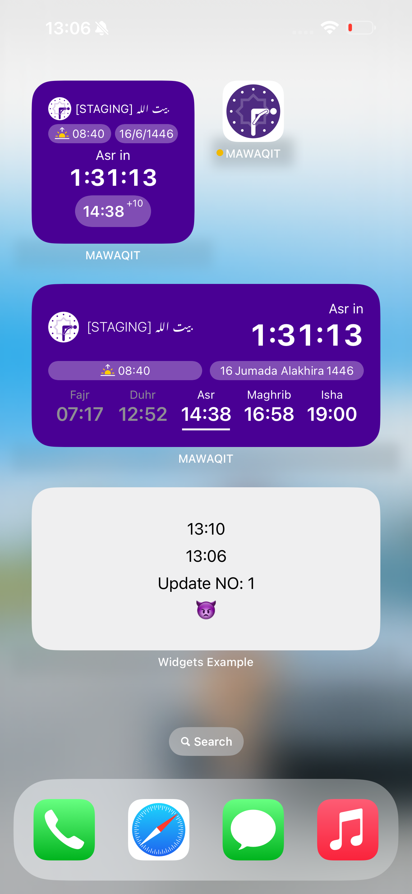
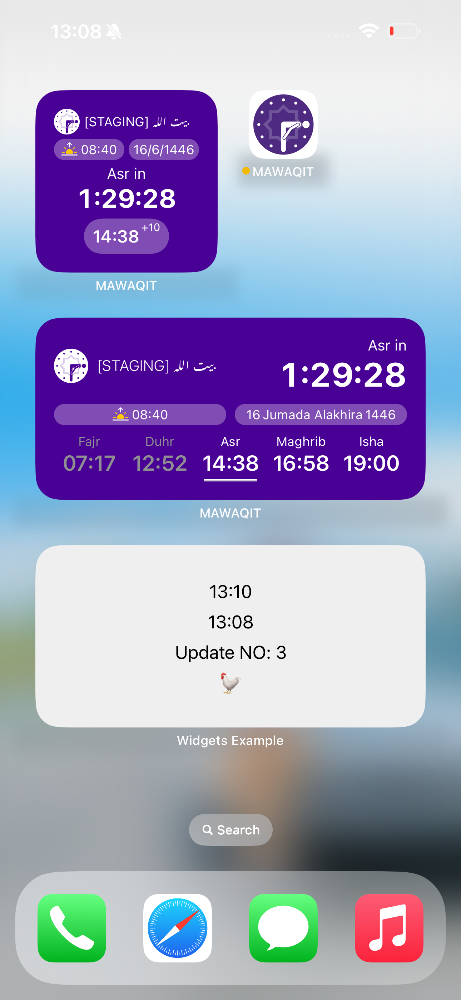

# iOS_Widgets
This Project contains basic structures of widget extension in Xcode, it has emojies ranges that update after a minutes.

## Screenshots
<table align="center">
  <tr>
    <td></td>
    <td style="width: 50px;"></td>
    <td></td>
     <td style="width: 50px;"></td>
    <td></td>
     <td style="width: 50px;"></td>
    <td></td>
  </tr>
</table>
